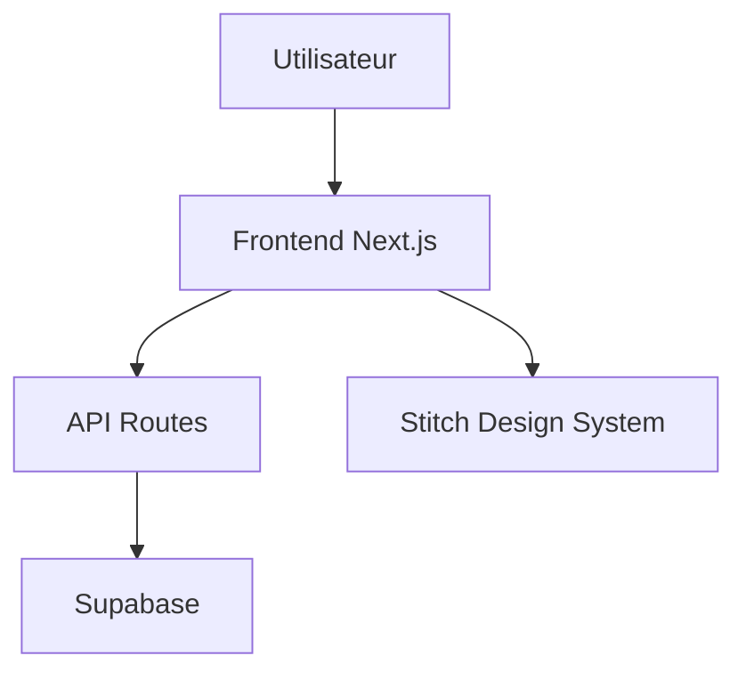

Un PM ouvre Cursor. Il tape "crée-moi une app de gestion de tâches avec authentification et un dashboard." L'IA génère 15 fichiers. Le frontend est beau. Le backend compile. Il clique sur "Sign Up."

Rien ne se passe.

Il demande à l'IA de corriger. Elle modifie 3 fichiers. Le Sign Up fonctionne. Le dashboard ne charge plus. Il redemande. L'IA modifie 5 fichiers. Le dashboard revient. Le Sign Up recasse.

C'est la Bug Doom Loop. L'IA corrige un bug, en crée deux. Le PM corrige les deux, en crée quatre. L'historique de conversation s'allonge. La qualité du code se dégrade à chaque itération.

La cause n'est pas l'IA. C'est le brief.

## Le PRD n'est plus un document d'alignement. C'est une ligne de commande.

Le PRD classique (Product Requirements Document) servait à aligner des équipes humaines : product, engineering, design. Il contenait des personas, des user stories, des plannings, des dépendances entre équipes.

En 2026, pour un PM qui vibe-code, le PRD a un rôle différent. C'est le fichier de configuration de l'IA. C'est l'instruction qui détermine si le code généré fonctionne du premier coup ou si tu passes 6 heures en Bug Doom Loop.

Un bon PRD pour le vibe coding ne ressemble pas à un PRD classique. Il contient des éléments que personne n'incluait avant.

## Le schéma de base de données : le bouclier anti-bugs

Le problème #1 du vibe coding : l'IA crée un frontend, puis devine le backend.

Tu lui demandes une app de tâches. Elle crée une belle interface avec des colonnes Kanban. Puis elle invente une structure de données qui ne matche pas. Le frontend attend un champ "status" en string. Le backend le stocke en enum. Le drag-and-drop casse silencieusement.

La solution : définir le schéma de données AVANT de coder. Dans ton PRD.

```typescript
type Task = {
  id: string
  title: string
  status: "todo" | "in_progress" | "done"
  assignee_id: string
  created_at: Date
  updated_at: Date
}
```

Quand l'IA a ce schéma, elle code le frontend ET le backend avec la même structure. Plus de désynchronisation. Plus de bugs silencieux.

C'est la règle la plus importante du vibe coding : les données d'abord, l'interface ensuite. Toujours.

## Le framework de prompt en 4 parties

Quand tu demandes à l'IA de coder une fonctionnalité, ne lui donne pas une phrase. Donne-lui 4 informations.

**Partie 1 : Le contexte.** Pourquoi cette fonctionnalité existe. "On construit le onboarding pour inciter l'utilisateur à créer sa première tâche dans les 2 minutes après l'inscription."

**Partie 2 : Le parcours utilisateur.** Les étapes exactes. "L'utilisateur voit un écran avec un champ titre pré-rempli 'Ma première tâche'. Il clique sur Créer. La tâche apparait dans la colonne 'À faire'. Un message de bienvenue disparait."

**Partie 3 : La technologie.** Les outils à utiliser. "Utilise Supabase pour la persistence. Les types sont dans lib/types.ts. La route est /onboarding. Server Component, pas de client state."

**Partie 4 : La direction design.** Les contraintes visuelles. "Reprends les tokens de docs/design.md. Fond sombre. Le bouton Créer utilise la couleur accent. Animation de transition de 200ms."

Ce framework fonctionne parce qu'il élimine l'ambiguïté. L'IA ne choisit pas la technologie (tu la choisis). L'IA ne devine pas le parcours (tu le décris). L'IA ne décide pas du style (le design.md le fixe).

## Comment structurer ton PRD pour le vibe coding

Un PRD pour le vibe coding contient 7 sections. Pas 15. Pas 25. Sept.

**Section 1 : Le problème.** Ce que les utilisateurs vivent. Avec des données.

**Section 2 : L'hypothèse de solution.** Ce que tu construis et pourquoi. Pas le détail d'implémentation. La direction.

**Section 3 : Le schéma de données.** Les types TypeScript de tes entités principales. C'est la source de vérité. Le frontend, le backend et les APIs en découlent.

**Section 4 : Les non-goals.** Ce que tu ne construis PAS. Cette section est ce qui empêche le scope creep. L'IA va essayer d'ajouter des features si tu ne la cadres pas.

**Section 5 : Les métriques de succès.** Comment tu sauras que ça marche. Un leading indicator et un lagging indicator, avec des seuils chiffrés.

**Section 6 : Les routes et pages.** La liste des URLs avec leur rôle. L'IA a besoin de la structure de navigation pour coder.

**Section 7 : Les contraintes techniques.** Le stack, les fichiers à ne pas toucher, les règles de code.

Ce PRD se transforme directement en CLAUDE.md (le fichier de contexte que Claude Code lit automatiquement). La transition est fluide parce que les deux documents parlent le même langage : des types, des routes, des contraintes.

## La règle du rollback

La Bug Doom Loop a une solution simple que personne ne veut appliquer : le rollback.

Si tu as échangé plus de 10 messages avec l'IA sur le même bug, arrête. Annule les changements (`git revert`). Pour aller plus loin sur les techniques de productivité IA, voir [5 techniques pour coder 10x plus vite](/blog/5-techniques-vibe-coding-productivite). Ferme le chat. Ouvre un nouveau chat propre. Reformule ton instruction en étant plus spécifique.

L'IA qui s'embourbe dans un long historique de corrections produit du code de plus en plus bancal. Un nouveau chat avec un prompt clair produit du code propre.

C'est contre-intuitif. Tu as l'impression de perdre du temps. Tu en gagnes.

## Les diagrammes d'architecture

Une fois ton PRD finalisé, l'étape suivante est le design : [comment utiliser Google Stitch pour créer ton design system avant de coder](/blog/vibe-design-google-stitch).

Un bonus qui change la qualité du code : les diagrammes Mermaid dans ton PRD.



L'IA lit les diagrammes Mermaid. Elle comprend les flux de données et les connexions entre composants. Un PRD avec un diagramme d'architecture produit un code mieux structuré qu'un PRD en texte seul.

## Passe à l'action

Tu veux un générateur qui te pose 7 questions et produit un PRD structuré pour le vibe coding ? Gratuit.

[Accède au Template PRD IA →](/outils/template-prd-ia)

Tu veux le système complet (12 prompts chaînés, du PRD au design au code à l'audit) ?

[Découvre le Pack Vibe Coding for PMs — 29 € →](/packs/vibe-coding-pm)
